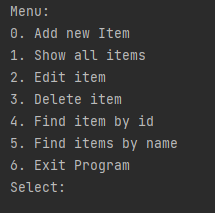
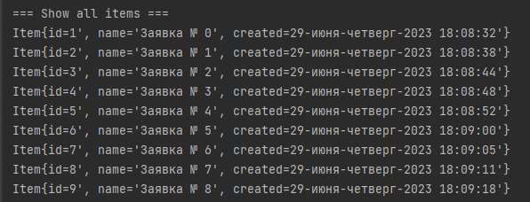
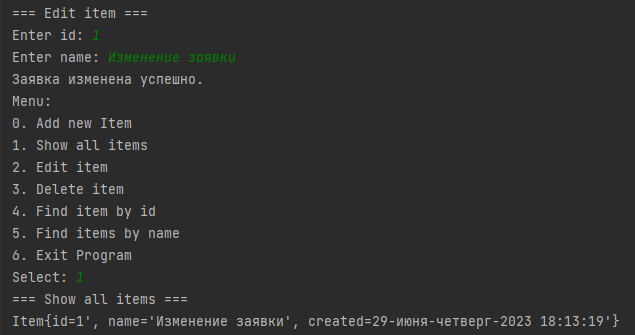
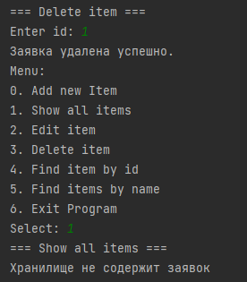

# Проект "Tracker"

* [Описание](#описание)
* [Функционал](#функционал)
* [Технологии](#технологии)
* [Интерфейс](#интерфейс)

## Описание

Консольное приложение для работы с задачами.

## Запуск через IDE
Перейте по пути src / main / java / ru / job4j / tracker / StartUI.java

Нажать на кнопку запуска метода main в IDE.

## Функционал

* Добавление задачи;
* Редактирование задачи;
* Удаление задачи;
* Вывод всех текущих задач;
* Поиск по имени и id;
* Две модели хранения данных:
    - Хранение в оперативной памяти (реализация Store -> MemTracker);
    - Хранение в базе данных PostgreSQL:
        - Работа с базой через запросы JDBC (реализация Store -> SqlTracker).

## Технологии

* Java 17;
* PostgreSQL;
* JDBC;
* Log4j;
* Junit5;
* Maven. Поддержка профилей test/production;
* Liquibase.

## Интерфейс

* Интерфейс меню

  

* Вывод всех задач

  

* Редактирование задачи

  

* Удаление задачи

  